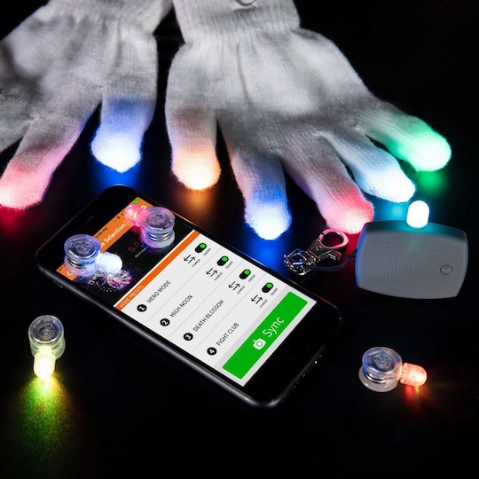

# EmazingLights Spectra Evolution Bluetooth Glove Set Configurator

This repo includes iOS code for controlling the EmazingLights Spectra Bluetooth light set. This set allowed users to easily preview and program custom flash patterns onto their light gloves. These lights were sold from 2016 until the early 2020's. The original set included:
- 10x Spectra Evolution Microlights
- 10x Premium eLite Evolution Casings
- 1x Spectra Evolution Smart Hub
- 20x CR 1225 Batteries
- 10x Standard LED Diffusers
- 1x Pair Medium Magic Stretch Gloves
- 1x Glove Pouch
- Instructions

The Smart Hub was central to programming the lights. It included a Bluetooth controller and an LED light that also acts as an IR emitter. The Smart Hub would communicate with the app over Bluetooth to help the user configure light patterns that they could preview on the Smart Hub's light. Once the user had chosen their pattern they could flash it onto the light using the Smart Hub's IR emitter.

## Legacy Code

The original source code is located in the Legacy folder. It was written from 2015 to 2016 using a now obsolete version of Swift (1/2) and **does not compile** with modern versions of Xcode. I've kept it so others can view it as a baseline or for historical reference. I've modified it enough to get Xcode to open it, but nearly everything would have to be re-written/redesigned to meet Swift 6 standards.

## Modernized Adaptation

**EmazingLightsModern** is an AI(Codex)-generated modernization of the original EmazingLights configuration code. It's a complete rewrite built around the original communication layer, with obsolete links and branding removed. This project focuses on providing a clean, modern implementation of the hardware pairing and configuration experience.

## A note on firmware

The legacy code includes the ability to update Smart Hub firmware over Bluetooth. Since I don't have the original firmware code or binaries I've removed it from the adaptation. Regardless of firmware version I don't believe the configuration API was ever significantly updated after initial release.

## ‼️ Important ‼️ - Contributors Needed

EmazingLightsModern compiles but I can't test it since I no longer have access to a Spectra device. I'm depending on the community to test this and fix any bugs that arise. I make no warranty that this code will work as intended. Use at your own risk! 

## License

This repository contains a legacy Xcode project originally created for EmazingLights/Emazing Group.

Emazing Group has granted permission to publish this code.

Unless otherwise noted, the code in this repository is licensed under the MIT License.
